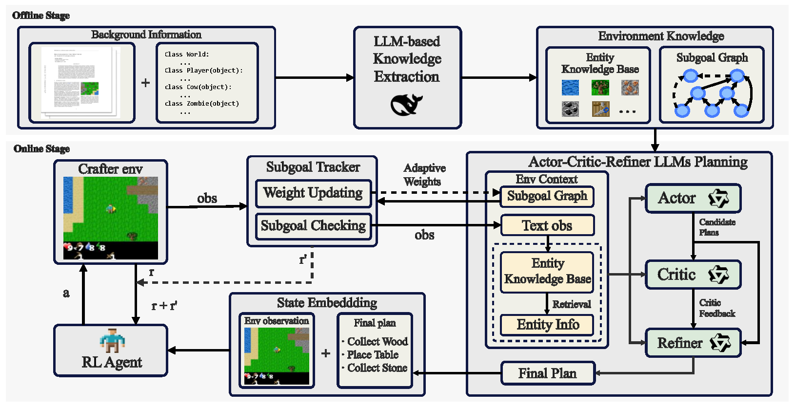

# 📄 Subgoal Graph-Augmented Planning for LLM-Guided Reinforcement Learning

The official repository of our SGA-ACR framework.



*To reproduce the results of SGA-ACR, please follow the instructions below*.

## Installation & Preparation
1. Install Package

```bash
conda create -n SGA_ACR python=3.10 -y
conda activate SGA_ACR
pip install --upgrade pip
pip install -r requirements.txt
```

2. Prepare models and configs

- First, You need to first download the Qwen3-8B model weights following [https://huggingface.co/Qwen/Qwen3-8B](https://huggingface.co/Qwen/Qwen3-8B).
- Then, you need to download the all-MiniLM-L6-v2 model weights following [https://huggingface.co/sentence-transformers/all-MiniLM-L6-v2](https://huggingface.co/sentence-transformers/all-MiniLM-L6-v2).
- After this, modify the following variables in `utils.py`:

```python
API_KEY = '' # Your LLM API key
BASE_URL = '' # URL for your API
GPT_MODEL = '' # API model name
LOCAL_MODEL_PATH = '' # Path to the local model (Qwen3-8B)
SBERT_PATH = '' # SentenceBert path  
```

## Offline Knowledge Extraction

To extract the structured knowledge, first enter the specified directory, then run the offline extraction program.

```bash
cd ./crafter_kb/
```

```python
python offline_extract.py
```

## Online Training

1. To train the SGA-ACR from scratch, first determine the LLM types for the actor, critic, and refiner in `models/llms_core.py`.

```python
self.actor_provider = "local"
self.critic_provider = "local"
self.refiner_provider = "local"
```
Here, `"local"` means using a local LLM (Qwen3-8B) to process the query; if it's not `"local"`, your LLM API will be used instead.

2. Then, to start training, simply run the following command:

```python
python train.py
```

## Test with the trained models

To test with the final models, run the following command:
``` python
python test.py
```

## Acknowledgements

Parts of the code are based on the [AdaRefiner](https://github.com/PKU-RL/AdaRefiner), [crafter](https://github.com/danijar/crafter) and [stable-baselines3](https://github.com/DLR-RM/stable-baselines3) repository.

